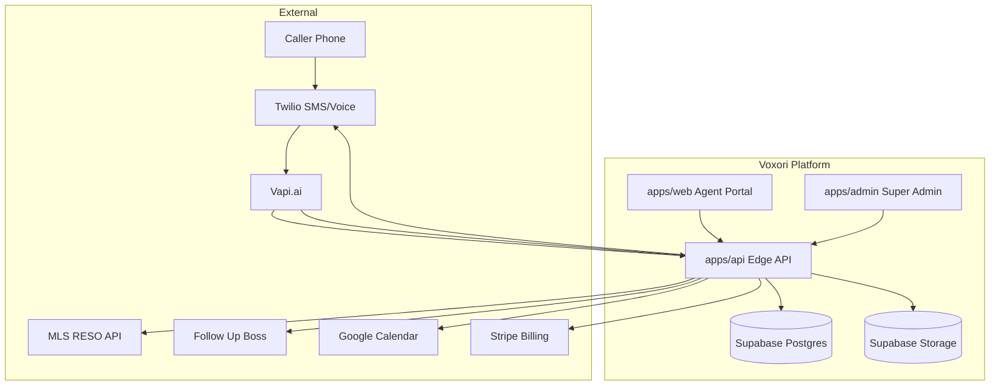
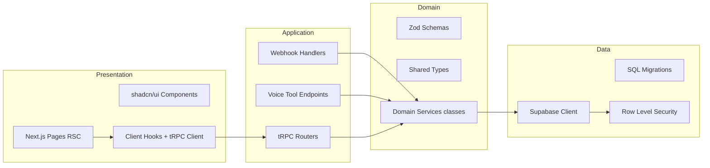
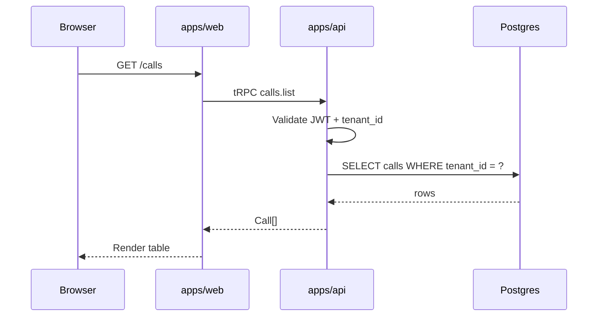
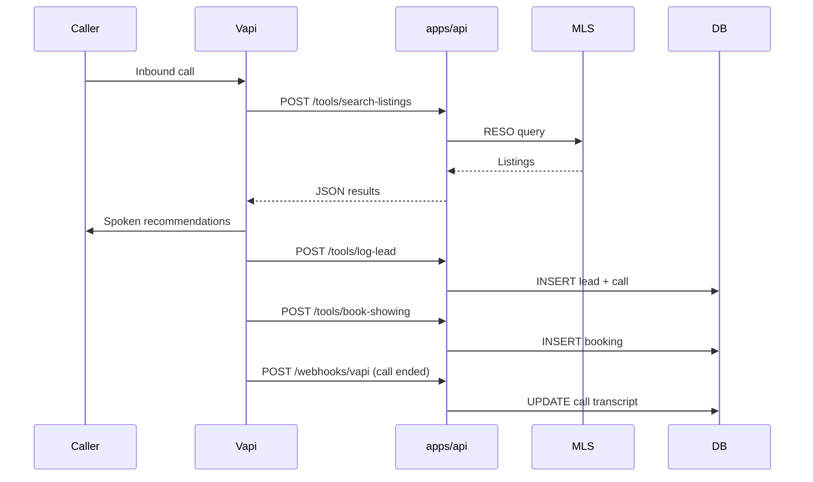
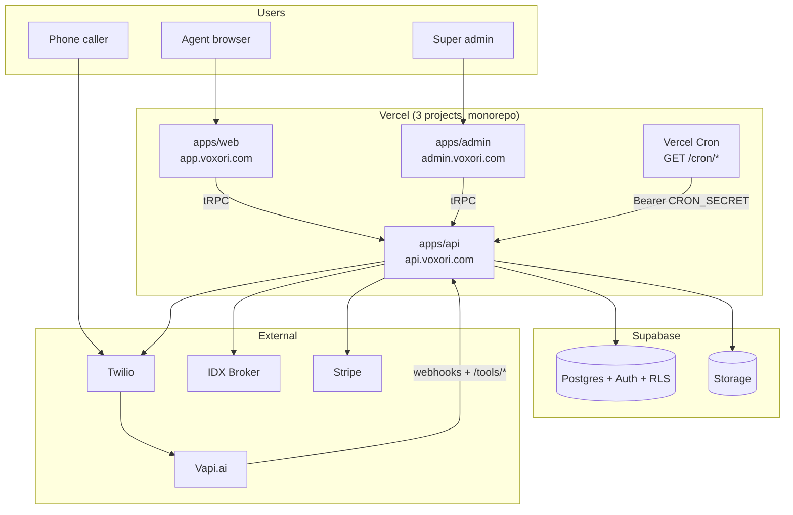

# Voxori Architecture

> Modular monolith for MVP. Clear layer separation with extraction paths for scale.

---

## 1. System Context



---

## 2. Repository Structure

```
voxori/
├── apps/
│   ├── web/          # Agent dashboard (port 3000)
│   ├── admin/        # Super-admin console (port 3001)
│   └── api/          # tRPC + webhooks + voice tools (port 3002)
├── packages/
│   ├── database/     # Supabase client, migrations, generated types
│   ├── shared/       # Zod schemas, domain constants
│   └── config/       # Shared ESLint, Tailwind, TypeScript configs
├── design-system/    # UI tokens (ui-ux-pro-max generated)
└── docs/             # PRD, architecture, audit matrices
```

---

## 3. Layer Responsibilities



| Layer | Rule |
|-------|------|
| **Presentation** | No direct DB access. Fetch via tRPC or Server Actions. |
| **Application** | Orchestrates domain services, validates input with Zod. |
| **Domain** | Pure business logic in dedicated classes/modules per concern. |
| **Data** | All tenant queries scoped by RLS. Service role only for webhooks. |

---

## 4. Request Flows

### 4.1 Authenticated Dashboard Read



### 4.2 Inbound Voice Call



---

## 5. MLS / IDX Broker Integration

**Primary source of truth:** [IDX Broker](https://developers.idxbroker.com/idx-broker-api/) partner API (`provider: idx_broker`).

| Config | Location |
|--------|----------|
| Default market | `MLS_MARKET=idx_broker_primary` (see `.env.example`) |
| Domain constants | `packages/shared/src/constants/mls-markets.ts` |
| Provider | `apps/api/lib/services/mls/idx-broker.provider.ts` |
| Tenant credentials | `integrations` (`type=mls_idx`) — encrypted `api_key`, optional `account_id` |
| Platform defaults (optional) | `IDX_BROKER_API_KEY`, `IDX_BROKER_PARTNER_API_KEY`, `IDX_BROKER_ACCOUNT_ID` |
| Voice tool | `POST /tools/search-listings` → `searchListings()` prefers active IDX integration, then cache, then legacy Bridge/Trestle |

**IDX API endpoints used (documented):**

- `GET https://api.idxbroker.com/clients/featured` — featured/agent listings (always attempted)
- `GET https://api.idxbroker.com/clients/listings?{query}` — filtered search using IDX shortcode params (`bd`, `hp`, `zipcode`, etc.)

Auth headers: `accesskey` (required), optional `ancillarykey` (partner), `outputtype: json`.

**Legacy fallbacks:** Bridge (`austin_central_texas`) and Trestle (`central_texas_ctx`) when platform RESO credentials are set and IDX returns no results.

**Compliance:** IDX Broker display/attribution rules apply to consumer-facing listing UI; voice agent reads normalized fields only.

---

## 6. Multi-Tenancy & Security

- **Tenant isolation:** Postgres RLS policies on all tenant-scoped tables using `auth_tenant_id()` from JWT custom claims.
- **Super admin:** `is_super_admin()` bypass for `apps/admin` operations only.
- **Webhook auth:** HMAC secrets (Vapi, Stripe, Twilio) validated per endpoint.
- **Secrets:** Environment variables via `.env.local`; never committed. Doppler/Infisical for production.

---

## 7. Key Architecture Decisions

| ID | Decision | Rationale | Revisit When |
|----|----------|-----------|--------------|
| ADR-001 | Modular monolith (Turborepo) | Solo founder speed; shared types | >10 engineers or independent scaling needs |
| ADR-002 | Supabase for auth + DB + storage | RLS, auth, pgvector in one stack | Custom compliance requiring dedicated VPC |
| ADR-003 | tRPC over REST for app API | End-to-end type safety with Next.js | Public third-party API needed |
| ADR-004 | Vapi.ai for voice MVP | 4–6 week delivery; built-in STT/TTS/tools | MRR >$100K, unit economics pressure |
| ADR-005 | Next.js over Vite SPA | SSR, App Router, unified deploy | N/A for current scope |
| ADR-006 | Marketing at `/landing`, dashboard at `/` | Unauthenticated visitors see landing; signed-in users skip marketing | Custom domain split (`voxori.com` vs `app.voxori.com`) if needed |

---

## 8. Hosting strategy (MVP)

**Decision (confirmed):** Stage 1 only — all three Next.js apps on **Vercel**, data on **Supabase Cloud**. No dedicated API host, job queue, or Kubernetes until scale triggers fire.

| Component | Stage 1 (MVP) | Deferred until trigger |
|-----------|---------------|------------------------|
| `apps/web` | Vercel → `app.voxori.com` | — |
| `apps/admin` | Vercel → `admin.voxori.com` | — |
| `apps/api` | Vercel → `api.voxori.com` | Dedicated API host when webhook/tool latency SLOs fail |
| Database + Auth | Supabase Cloud | Dedicated VPC / read replicas at 100K+ DAU |
| Scheduled jobs | Vercel Cron → `apps/api` routes | BullMQ / worker service when sync lag or retry volume exceeds cron limits |
| Voice | Vapi.ai (managed) | Custom voice stack when unit economics require it |

### Stage 1 topology



### Deferral triggers (Stage 2+)

| Trigger | Next step |
|---------|-----------|
| MLS sync cannot keep up on 15‑min cron | Extract `mls-sync` to BullMQ worker |
| CRM retry backlog or rate limits | Dedicated CRM sync worker + queue |
| API cold starts hurt Vapi tool latency | Dedicated API host or Vercel Pro tuning |
| Multi-region or compliance VPC | Supabase dedicated / self-hosted Postgres |
| >10 engineers or independent deploy cadence | Split services per ADR-001 extraction paths |

**Deploy checklist:** See [DEPLOY_VERCEL.md](./DEPLOY_VERCEL.md). Infrastructure steps live in [LAUNCH_PLAYBOOK.md](./LAUNCH_PLAYBOOK.md) → Phase 1.

---

## 9. Extraction Paths (Future)

1. **MLS sync worker** — BullMQ job consuming RESO delta feeds (when sync >15 min acceptable lag fails)
2. **CRM sync worker** — Retry queue for FUB/KvCORE API rate limits
3. **Voice provider abstraction** — Interface `VoiceProvider` with Vapi + Twilio Realtime implementations
4. **Read replicas** — Supabase read replica at 100K+ DAU

---

## 10. Scheduled jobs (cron)

Vercel Cron (configured in `apps/api/vercel.json`) hits authenticated routes on `apps/api`:

| Route | Schedule | Auth | Purpose |
|-------|----------|------|---------|
| `GET/POST /cron/mls-sync` | Every 15 min | `x-voxori-internal-secret` or `Authorization: Bearer` | Upsert cached `listings` from active `mls_idx` integrations |
| `GET/POST /cron/crm-retry` | Hourly | same | Retry `leads` with `crm_sync_state = failed` via Follow Up Boss |
| `GET/POST /cron/post-call-sms` | Every 5 min | same | Retry pending `sms_outbox` rows (listing SMS, confirmations) |

**Vercel:** Set `CRON_SECRET` in the API project (same value as `INTERNAL_API_SECRET` is fine). Vercel Cron sends `Authorization: Bearer $CRON_SECRET` on GET. Manual/local testing uses POST + `x-voxori-internal-secret`. Jobs are idempotent per tenant batch.

---

## 11. Observability (Planned)

- **Errors:** Sentry
- **Logs:** Structured JSON → Axiom / Better Stack
- **Product analytics:** PostHog
- **Call tracing:** OpenTelemetry spans on webhook + tool handlers

---

## 12. Related design docs

| Doc | Topic |
|-----|--------|
| [LAUNCH_PLAYBOOK.md](./LAUNCH_PLAYBOOK.md) | Launch phases, service setup matrix, sprint plan |
| [DEPLOY_VERCEL.md](./DEPLOY_VERCEL.md) | Vercel MVP deploy checklist (3 projects, env vars, cron) |
| [VAPI_IDX_BUYER_FLOW.md](./VAPI_IDX_BUYER_FLOW.md) | Buyer qualify → IDX search → post-call listing SMS |
| [TELEPHONY_DECISION.md](./TELEPHONY_DECISION.md) | Twilio, Vapi import, 10DLC launch checklist |
