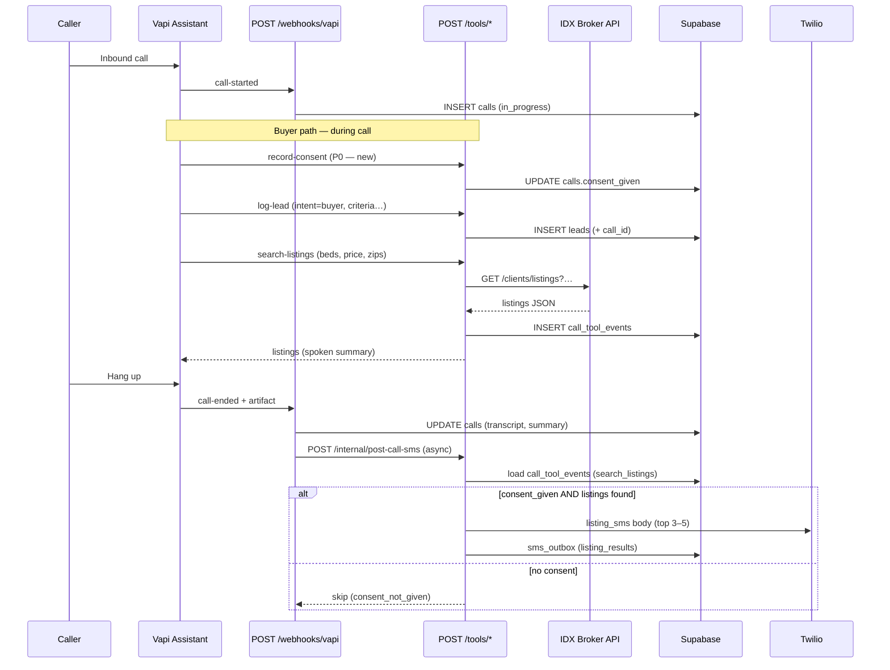

# Vapi × IDX Broker — Buyer Qualification → Search → SMS

> Architecture for inbound buyer calls: Vapi qualifies, backend searches IDX Broker, Twilio sends listing SMS.

**Last updated:** 2026-06-03  
**Primary market (design partner):** ABOR/CTX via IDX Broker (`idx_broker_primary`)

---

## 1. Product flow (target)

1. Caller dials tenant Voxori/Vapi number.
2. Assistant detects **buyer vs seller**; seller path uses `log-lead` only (out of scope here).
3. **Buyer qualification:** location, beds/baths, budget, timeline, financing, name/phone.
4. Backend maps criteria → IDX query → returns listings.
5. Assistant reads 1–2 highlights on the call.
6. After hangup (or async tool), SMS with top N listings + links + opt-out language.

---

## 2. Sequence diagram



---

## 3. What exists today vs gaps

### Implemented

| Component | Path |
|-----------|------|
| Vapi webhook (lifecycle) | `apps/api/app/webhooks/vapi/route.ts` |
| Call persistence | `apps/api/lib/services/vapi-call.service.ts` |
| Tool auth | `apps/api/app/tools/_auth.ts` (`X-Voxori-Tool-Secret`) |
| Search listings tool | `apps/api/app/tools/search-listings/route.ts` |
| Log lead tool | `apps/api/app/tools/log-lead/route.ts` |
| IDX provider | `apps/api/lib/services/mls/idx-broker.provider.ts` |
| Search orchestration | `apps/api/lib/services/mls/search.service.ts` |
| Post-call SMS | `apps/api/lib/services/post-call-sms.service.ts` |
| In-call SMS tool | `apps/api/app/tools/send-confirmation/route.ts` |
| Leads API | `apps/api/lib/trpc/routers/leads.router.ts` |
| MLS cache sync | `apps/api/lib/services/mls/sync.service.ts`, cron `mls-sync` |

### Gaps (P0 for design-partner demo)

1. **SMS consent:** `calls.consent_given` exists but nothing sets it → post-call SMS always `consent_not_given`.
2. ~~**Listing SMS payload:** Post-call SMS only says “listings shared”; no addresses/prices/links.~~ **Implemented** — `processPostCallSms` sends `listing_results` from latest `search_listings` `call_tool_events` (top 3–5, merge with summary if ≤1600 chars).
3. **Vapi tool wiring:** `template-composer.ts` registers tool *names* only — no `server.url`, headers, or parameter schemas.
4. **`log-lead` → `call_id`:** Lead insert omits `call_id` FK.
5. **No listing URLs:** `ListingResult` lacks `detailUrl`; IDX `first` field not captured.
6. **City search:** Voice collects “Austin” but IDX query only supports ZIP (`zipcode`, `aw_zipcode[]`).
7. **`tool_secret`:** Referenced in docs but not auto-generated on agent provision.
8. **Backend “qualifier agent”:** Not built — criteria normalization is inline in Vapi LLM + tool params today.

---

## 4. Vapi integration patterns

### During-call: HTTP tools (current Voxori direction)

- Vapi invokes tools as **HTTP POST** to Voxori (`/tools/*`) with `X-Voxori-Tool-Secret`.
- Tool results return synchronously; assistant speaks a short summary.
- `tool-calls` webhook is **ignored** in `webhooks/vapi/route.ts` — HTTP routes + `call_tool_events` are source of truth.

**Best practice for multi-step buyer flow:**

1. `record-consent` — early, after disclosure.
2. `log-lead` — once minimum criteria collected (idempotent per call).
3. `search-listings` — when beds + budget + geo (ZIP) known; may retry with relaxed filters.
4. Optional: `send-confirmation` for immediate SMS (requires consent + 10DLC); prefer post-call for long payloads.

### Post-call: structured outputs (P1)

- Vapi **structured outputs** analyze full transcript after hangup (buyer_criteria JSON schema).
- Use as **fallback** when tools weren’t called or params were incomplete.
- Deliver via `end-of-call-report` webhook (Voxori currently handles `call-ended` — align event types).

### Async search + SMS (recommended for IDX latency)

- Keep **in-call** `search-listings` for voice (limit 3 results, &lt;5s).
- On `call-ended`, `processPostCallSms` reads latest successful `search_listings` event output and sends **`listing_results`** SMS (new `sms_type`), separate from `post_call_summary`.

---

## 5. IDX Broker API capabilities

**Base:** `https://api.idxbroker.com`  
**Auth headers:** `accesskey` (tenant or platform), optional `ancillarykey` (partner), `outputtype: json`

### Endpoints used in codebase

| Endpoint | Purpose |
|----------|---------|
| `GET /clients/featured` | Agent/account featured listings (fallback) |
| `GET /clients/listings?{query}` | Filtered search (custom form params) |

### Search parameters (IDX docs + `buildIdxSearchQuery`)

| IDX param | Meaning | Voxori today |
|-----------|---------|--------------|
| `idxID` | MLS filter | From `market.idxMlsId` (optional) |
| `bd` / `amin_bedrooms` | Min beds | ✅ `minBedrooms` |
| `tb` / `amin_bathrooms` | Min baths | ❌ not mapped |
| `hp` / `amax_listingPrice` | Max price | ✅ `maxPrice` |
| `lp` / `amin_listingPrice` | Min price | ❌ not mapped |
| `zipcode` / `aw_zipcode[]` | ZIP | ✅ up to 5 ZIPs |
| `amin_sqft` | Min sqft | ✅ `minSqft` |
| `a_cityName` / city fields | City | ❌ not mapped |
| `ublat` / `ublong` / radius | Geo box | ❌ not mapped |
| `pt` | Property type | ❌ not mapped |
| `a_status[]=active` | Active only | ✅ hardcoded |

### Other IDX components (not yet used)

- `mls/cities`, `mls/searchfields` — city/ZIP lookup for voice “Austin” → ZIP list.
- `leads/*` — IDX lead capture (redundant with Voxori `leads` table).
- Saved links / widgets — not needed for API search.

### Limits & constraints

- **Rate limit:** ~300/hr (Lite), 500/hr (Platinum) per `accesskey`; **1500/hr** with partner `ancillarykey` per client account.
- **412** when over hourly limit — cache + featured fallback critical.
- **Scope:** API returns **agent/account listings**, not full MLS (IDX policy).
- **`/clients/listings`:** Documented as search-style; may vary by account tier — code falls back to featured + client filter.

### Credentials model

| Mode | Source |
|------|--------|
| Tenant | `integrations.credentials` encrypted `api_key`, optional `account_id` |
| Platform | `IDX_BROKER_API_KEY`, `IDX_BROKER_PARTNER_API_KEY`, `IDX_BROKER_ACCOUNT_ID` |
| Resolution | `resolveIdxBrokerCredentials()` — tenant key unless `mode: platform` or invalid placeholder |

---

## 6. Field mapping — voice slots → IDX params

| Voice / lead field | Vapi tool param | DB column | IDX query param | Notes |
|--------------------|-----------------|-----------|-----------------|-------|
| Intent = buying | `intent` | `leads.notes` | — | Route to buyer script |
| Caller name | `caller_name` | `leads.name` | — | |
| Phone | `caller_phone` | `leads.phone` | — | Default from Vapi `customer.number` |
| Email | `caller_email` | `leads.email` | — | Optional |
| Area / city | `area_of_interest` | `leads.area_of_interest` | → `zip_codes[]` | **P0:** city→ZIP lookup table or IDX `mls/cities` |
| ZIP(s) | `zip_codes` | — | `zipcode` / `aw_zipcode[]` | Primary geo filter |
| Min beds | `beds` / `min_bedrooms` | `leads.beds` | `bd`, `amin_bedrooms` | |
| Min baths | `baths` | `leads.baths` | `tb`, `amin_bathrooms` | P1 mapping |
| Max budget | `budget_max` / `max_price` | `leads.budget_max` | `hp`, `amax_listingPrice` | |
| Min budget | `budget_min` | `leads.budget_min` | `lp`, `amin_listingPrice` | P1 mapping |
| Min sqft | `min_sqft` | — | `amin_sqft` | Optional |
| Timeline | `timeline` | `leads.timeline` | — | CRM/SMS copy only |
| Financing | `financing_status` | `leads.financing_status` | — | Qualification only |
| Market | `market` | `integrations.market_id` | `idxID` | Default `idx_broker_primary` |
| SMS consent | `consent_given` | `calls.consent_given` | — | TCPA gate |
| Listing limit | — | — | — | Voice: 3; SMS: 5 |

**Fair Housing:** Never map race, religion, familial status, etc. Price, beds, baths, sqft, ZIP/city only (per PRD).

---

## 7. Data model recommendations

### Store qualification in `leads` (primary)

- Use existing `leads` row as CRM-ready record.
- **Add:** `call_id` on insert from `log-lead` (resolve via `call-tool-events.service`).
- **Optional P1:** `search_criteria jsonb` on `leads` for normalized IDX params.

### Ephemeral search results

- **`call_tool_events`:** `tool_name=search_listings`, `input` = IDX params, `output` = full API response.
- Post-call SMS reads this — no duplicate IDX call if event &lt; 15 min old.

### SMS outbox types

| `sms_type` | When |
|------------|------|
| `post_call_summary` | Today — generic follow-up |
| `listing_results` | **P0** — top N listings with links |
| `showing_confirmation` | Existing booking flow |

### Consent

- `calls.consent_given`, `calls.consent_state` (migration 011).
- Set via new `record-consent` tool or first message in structured output.

---

## 8. SMS payload format (P0)

```
Thanks for calling {AgentName}. Here are {N} homes matching your search ({beds}+ bd, up to ${price} in {area}):

1. 123 Main St, Austin — $425,000 · 3bd/2ba
   {detailUrl}

2. …

Reply STOP to opt out. Msg&data rates may apply.
```

- **TCPA:** Explicit verbal consent logged before first marketing SMS.
- **10DLC:** Tenant `phone_numbers` FROM via `resolveTenantSmsFromNumber`.
- **IDX compliance:** Include broker attribution line if required by partner terms on links (use IDX-hosted detail URLs, not scraped photos).

---

## 9. Error handling

| Condition | In-call behavior | Post-call SMS |
|-----------|------------------|---------------|
| No IDX credentials | “I’ll have the agent send matches shortly” | Summary only; flag integration |
| IDX 412 / down | Use `listings` cache via `search.service` | Same cached results |
| Zero results | Widen price ±10% or drop sqft; retry once | “No exact matches; agent will follow up” |
| No consent | Skip SMS tools | `consent_not_given` — no listing SMS |
| Twilio missing | Dev log skip | `twilio_not_configured` |
| Tool timeout | Speak “searching…” filler; async post-call | Re-run search on hangup |

---

## 10. Relation to existing services

```
search-listings route
  → searchListings(db, params)
  → fetchIdxBrokerListings (live)
  → searchCachedListings (DB)
  → Bridge/Trestle fallback

mls-sync cron
  → syncIntegrationListings
  → searchListingsForIntegration (featured / broad pull)
  → upsert listings table
```

Voice search should **prefer live IDX**; cache is fallback when live empty or rate-limited.

---

## 11. Recommended Vapi assistant prompt structure (high level)

```
## Role
Inbound receptionist for {businessName}. Service areas: {serviceAreas}.

## Opening
Greet → ask buy/sell/other → recording/SMS disclosure → record consent.

## Buyer branch
Collect: name, phone confirm, area (city or ZIP), beds, baths, max budget, timeline, pre-approved?
When complete: call log-lead → call search-listings → read top 2 briefly.
Offer showing booking if interested.

## Seller branch
log-lead only; no MLS search.

## Rules
- Never filter on protected classes.
- Confirm SMS opt-in before promising text listings.
- If search returns empty, relax one criterion and retry once.
- Keep responses under 2 sentences unless reading listing details.
```

Tool definitions need explicit JSON schemas (not `additionalProperties: true`).

---

## 12. Implementation phases

### P0 — Design partner demo (ABOR/CTX + IDX)

1. Wire Vapi tools with server URLs + `X-Voxori-Tool-Secret` + schemas.
2. Add `record-consent` tool → `calls.consent_given`.
3. Fix `log-lead` to set `call_id`.
4. Extend post-call SMS (or new processor) to send `listing_results` from `search_listings` events.
5. City → ZIP: static map for Austin metro + accept explicit ZIP from caller.
6. Capture IDX `first` / construct detail URL in `normalizeIdxListing`.

### P1 — Production hardening

1. IDX `mls/cities` lookup service for free-text areas.
2. Map baths, min price, property type in `buildIdxSearchQuery`.
3. Vapi structured outputs schema `buyer_qualification_v1` on `end-of-call-report`.
4. Dedicated `BuyerSearchCoordinator` service (normalize → search → SMS).
5. Rate-limit aware queue for IDX (respect 412, prefer cache).
6. Link `leads.search_criteria` jsonb for dashboard visibility.

---

## 13. API / webhook touchpoints (repo)

| Event / route | File |
|---------------|------|
| `POST /webhooks/vapi` | `apps/api/app/webhooks/vapi/route.ts` |
| `POST /tools/search-listings` | `apps/api/app/tools/search-listings/route.ts` |
| `POST /tools/log-lead` | `apps/api/app/tools/log-lead/route.ts` |
| `POST /tools/send-confirmation` | `apps/api/app/tools/send-confirmation/route.ts` |
| `POST /internal/post-call-sms` | `apps/api/app/internal/post-call-sms/route.ts` |
| Post-call processor | `apps/api/lib/services/post-call-sms.service.ts` |
| Call lifecycle | `apps/api/lib/services/vapi-call.service.ts` |
| Tool events | `apps/api/lib/services/call-tool-events.service.ts` |
| IDX provider | `apps/api/lib/services/mls/idx-broker.provider.ts` |
| Search orchestration | `apps/api/lib/services/mls/search.service.ts` |
| Vapi client | `apps/api/lib/vapi/client.ts` |
| Assistant templates | `apps/api/lib/agents/template-composer.ts` |
| Markets | `packages/shared/src/constants/mls-markets.ts` |

---

## 14. Open questions

1. Confirm design-partner IDX account tier: is `GET /clients/listings` enabled or featured-only?
2. What is the correct ABOR `idxID` for `idx_broker_primary` market config?
3. Detail URL pattern: IDX `first` field vs constructing from `listingID` + account subdomain?
4. Single post-call SMS vs split (summary + listings)?
5. Should in-call `send-confirmation` send listings (TCPA risk) or only post-call?
6. Vapi event type: migrate webhook from `call-ended` to `end-of-call-report` for structured outputs?

---

## 15. Engineering tickets (next)

1. **Provision Vapi tools on assistant create** — server URL, secret header, JSON schemas per tool.
2. **`POST /tools/record-consent`** — set `calls.consent_given` + optional `consent_state`.
3. **Link leads to calls** — resolve `call_id` in `log-lead`; set `intent=buyer` in notes/status.
4. **Listing detail URLs** — extend `ListingResult`, parse IDX `first` field.
5. ~~**Post-call listing SMS** — new builder in `post-call-sms.service.ts`, `sms_type=listing_results`.~~ **Done**
6. **City→ZIP resolver** — Austin metro map + optional IDX `mls/cities` fetch.
7. **Expand IDX query mapping** — baths (`tb`), min price (`lp`), document tier fallback behavior.
8. **Buyer E2E test** — seed tenant with IDX key, mock Vapi tool chain, assert SMS outbox body. *(Unit tests for listing SMS builder + merge/split plan in `post-call-sms.service.test.ts`; full E2E still open.)*
